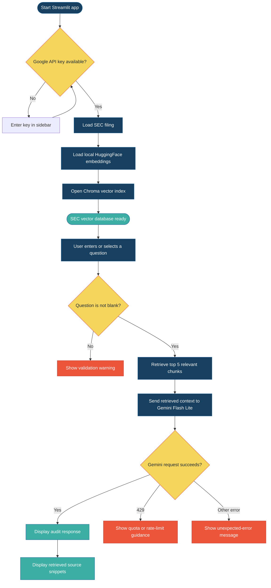

# SEC Semantic Auditor Process Flow

The diagram below is rendered by GitHub as an interactive Mermaid flow chart. Select a node to open the related source file or data artifact.

## Process stages

| Stage | What happens | Source |
| --- | --- | --- |
| Collection | Downloads the latest AAPL 10-K from SEC EDGAR | [ingest.py](ingest.py) |
| Source data | Stores the pinned Apple filing used by the project | [full-submission.txt](sec-edgar-filings/AAPL/10-K/0000320193-25-000079/full-submission.txt) |
| Embeddings | Loads `all-MiniLM-L6-v2` locally | [app.py](app.py) |
| Retrieval | Searches the Chroma index for the five most relevant chunks | [app.py](app.py) |
| Synthesis | Sends retrieved context to `gemini-3.5-flash-lite` with five retries | [app.py](app.py) |
| Presentation | Shows the answer and retrieved evidence in Streamlit | [app.py](app.py) |
| Provenance | Documents the dataset, source URLs, and limitations | [DATA_SOURCE.md](DATA_SOURCE.md) |

## Reproduce the pipeline

1. Install dependencies from [requirements.txt](requirements.txt).
2. Set `GOOGLE_API_KEY` or enter it in the Streamlit sidebar.
3. Run `ingest.py` only when you intentionally want to download a newer filing.
4. Start the interface with `streamlit run app.py`.

The raw SEC filing is the source of truth. The Chroma files are derived search artifacts, and Gemini output should be checked against the displayed source snippets and original filing.
