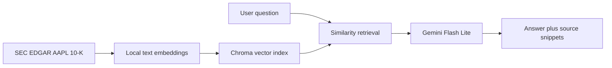

# SEC 10-K Semantic Auditor

A Streamlit question-answering application for exploring Apple Inc.'s SEC 10-K filing. The application combines local document embeddings, Chroma similarity search, and Gemini synthesis to answer financial, operational, and risk questions with retrieved source snippets.

## Problem statement

Important information in a regulatory filing is spread across hundreds of pages. This project makes the filing easier to explore by retrieving the most relevant passages for a natural-language question and presenting the generated answer alongside supporting evidence.

This tool is for exploratory document analysis. It is not investment advice, an accounting opinion, or a replacement for the original SEC filing.

## How it works



See the detailed [interactive process flow](PROCESS_FLOW.md) and [data source documentation](DATA_SOURCE.md).

## Features

- Natural-language questions over an Apple 10-K filing
- Local `all-MiniLM-L6-v2` embeddings
- Chroma vector retrieval of the five most relevant chunks
- Gemini `gemini-3.5-flash-lite` synthesis with automatic retries
- Source snippets displayed with every successful answer
- Graceful handling for blank questions, API quota errors, and unexpected failures

## Repository contents

| Path | Description |
| --- | --- |
| [app.py](app.py) | Streamlit application |
| [agent.py](agent.py) | Standalone retrieval pipeline |
| [ingest.py](ingest.py) | SEC EDGAR filing downloader |
| [DATA_SOURCE.md](DATA_SOURCE.md) | Dataset provenance, problem statement, and limitations |
| [PROCESS_FLOW.md](PROCESS_FLOW.md) | Interactive Mermaid process flow |
| [requirements.txt](requirements.txt) | Python dependencies |
| `sec-edgar-filings/` | Pinned raw SEC filing |
| `chroma_db_clean/` | Derived Chroma index used by the app |

## Setup

Python 3.10 or newer is recommended.

```bash
git clone https://github.com/samvedsangle/sec-semantic-agent-v2.git
cd sec-semantic-agent-v2
python -m venv venv
source venv/bin/activate
pip install -r requirements.txt
```

Set a Google Gemini API key in the environment:

```bash
export GOOGLE_API_KEY="your-api-key"
```

Alternatively, enter the key in the Streamlit sidebar when the app starts.

## Run the app

```bash
streamlit run app.py
```

Then enter a question or select one of the sample audit queries.

## Refresh the filing

The repository includes a pinned Apple 10-K and its derived application index. To download the latest available AAPL 10-K from SEC EDGAR, review the User-Agent contact details in `ingest.py`, then run:

```bash
python ingest.py
```

A refreshed filing requires rebuilding the Chroma index before it can be queried by the application. See [DATA_SOURCE.md](DATA_SOURCE.md) for source URLs, collection details, and limitations.

## Data source

The primary source is the U.S. Securities and Exchange Commission EDGAR archive. The included filing is Apple Inc.'s Form 10-K, accession `0000320193-25-000079`, filed October 31, 2025. The official filing links and data inventory are documented in [DATA_SOURCE.md](DATA_SOURCE.md).

## Responsible use

Always verify material claims against the original SEC filing. Generated responses can omit context, misinterpret disclosures, or reflect temporary API or model availability constraints.
